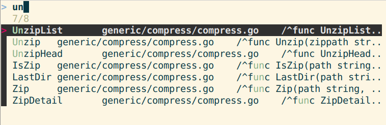

# micro-jump - Jump to function in micro editor

Jump to any function, class or heading with F4. Go, Markdown, Python, C... A plugin for micro editor. 



## Supports 40+ languages

Jump supports all languages supported by your ctags. My 'ctags --list-languages' has 44 entries: Ant, Asm, Asp, Awk, Basic, BETA, C, C++, C#, Cobol, DosBatch, Eiffel, Erlang, Flex, Fortran, Go, HTML, Java, JavaScript, Lisp, Lua, Make, MatLab, ObjectiveC, OCaml, Pascal, Perl, PHP, Python, REXX, Ruby, Scheme, Sh, SLang, SML, SQL, Tcl, Tex, Vera, Verilog, VHDL, Vim, YACC, markdown.

## Install

On Debian

	$ sudo apt-get update
	$ sudo apt-get -y install micro fzf exuberant-ctags
	$ micro --plugin install jump

For other distributions and operating systems, see [help/jump.md](help/jump.md). 

## Use F4 to Jump

	$ micro tero.py

Write some Python. Jump also supports Go, C, JavaScript...

```python
def hello():
    print("hello")

def bar():
    print("bar")

def foo():
    print("foo")
```

Ctrl-S Save. 

Press F4 to jump. Use up and down arrows to select a function. You can also type part of the name. Press enter to jump.

## Markdown

Writing books, are we? Markdown support & interactive table of contents are explained in [help/jump.md](help/jump.md). 

Copyright 2020-2022 Tero Karvinen https://TeroKarvinen.com
Code repository https://github.com/terokarvinen/micro-jump
MIT license
